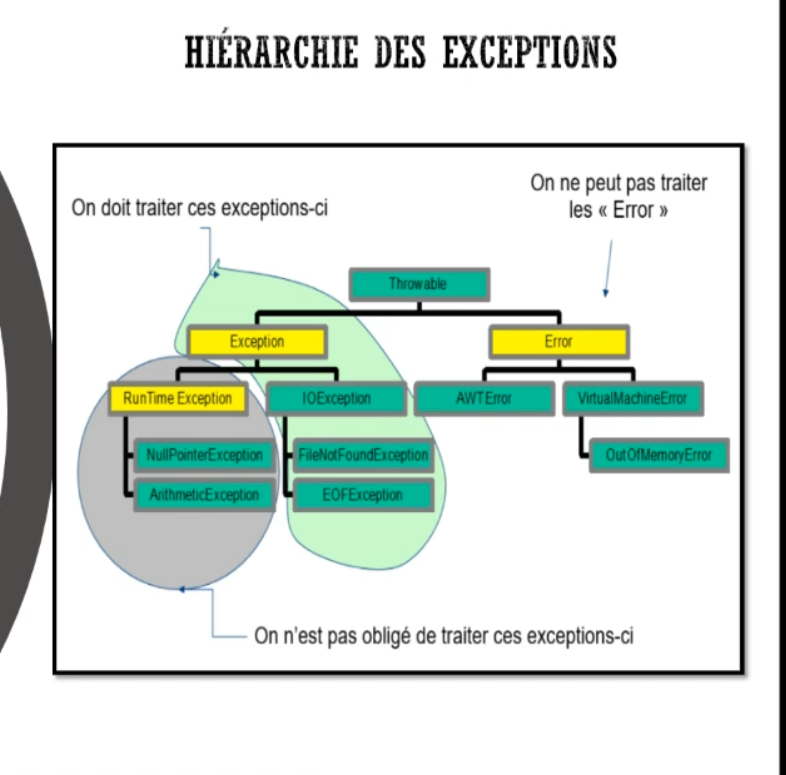

# day 5 Daily Java Drip(DJD)
## Objectif Global:
Ce cours fait partie d'un ensemble d'une séance de de cours sur le angage JAVA et qui va me permettre de réviser les base du langage.
Je partagerai quotidiennement les différentes parties de cette séance.
### Objectif du jour(Gérer les exceptions en Java)
GESTION DES EXCEPTIONS EN LANGAGE JAVA
- S'approche du C++
- Des erreurs surviennent dans tout programme.
- Distinction entre Exception et Error, deux classes apparentées.
- La classe Exception traite les erreurs prévisibles qui apparaissent dans l'exécution d'un programme:
  . Panne du réseau
  . Fichier inexistant
  . Problème propre à la logique "Business".
- La classe Error traite les conditions sérieuses que le programmeur n'est pas censé traiter.
- Le traitement des exceptions contient deux aspects:
- L'interception des exceptions
  . Utilisation du bloc try-catch-finally pour récupérer les exceptions.
  . Et réaliser les actions nécessaires
- Le lancement(la génération) d'exceptions.
  . Automatiquement par l'environnement run-time ou la machine virtuelle pour certaines exceptions prédéfinies par Java.
  . Explicitement par le développeur dans une méthode avec "throws" et "throw".

## Le RunTimeException
Les exceptions d’exécution permettent de gérer les problèmes inattendus qui surviennent pendant l’exécution de votre application pour éviter les pannes. Sa gestion est facultative puisqu'elle s'exécute une fois compilé
